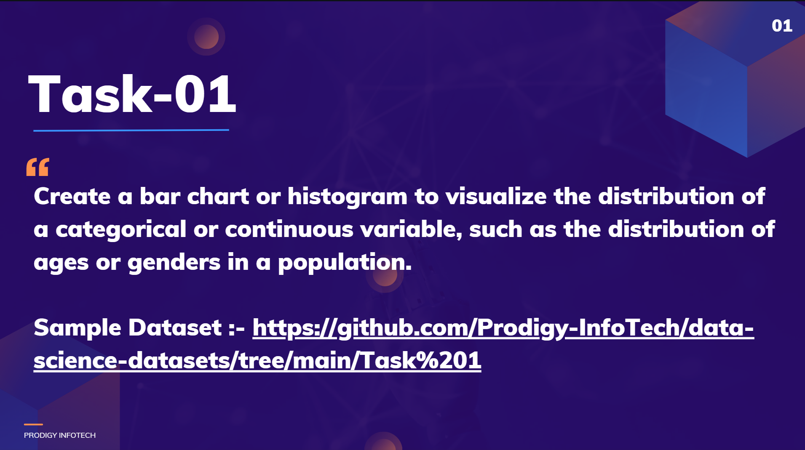

# Prodigy-Ds-Task-1

  

---

## 📊 Dataset  

- **Name**: `world_population_dataset.csv`  
- **Years Covered**: 2001 – 2022  
- **Content**: Country/region-wise population records  
- 📂 [[worldpopulationdata](https://raw.githubusercontent.com/ProgrammerAk55/Prodigy-Ds-Task-1/refs/heads/main/worldpopulationdata%20(1).csv)]
---

## ⚙️ Tools & Libraries 

- Jupyter notebook

- Pandas

- Numpy

- Matplotlip & Seaborn for visualization

---

## 🔍 Exploratory Data Analysis (EDA)

    During the EDA Process, I performed the following steps:
    
✔️ **Data Cleaning** – Identified and handled missing values, duplicates, and outliers to ensure data quality 

✔️ **Exploration** – Examined the distribution and characteristics of categorical and continuous variables

✔️ **Visualization** – Created bar charts and stacked bar charts to illustrate population trends and variable distributions

---

## 📈 Results & Insights

📌 The population exhibited a steady increase from 2001 to 2022

📌 Noticeable regional variations in growth trends were observed

📌 The dataset has been thoroughly cleaned and is prepared for subsequent modeling

---

## Conclusion

This exploratory data analysis offered important insights into the distribution of key variables within the dataset. It establishes a solid groundwork for deeper investigation and advanced modeling in the data science pipeline.

Thank you for taking the time to review my submission!

---

## 📬 Contact  

For any inquiries or feedback regarding this project, please contact:

💼 LinkedIn: [[Anilkumar] ](https://www.linkedin.com/in/y-anilkumar/) 

📧 Email: anilykumar55@gmail.com 

